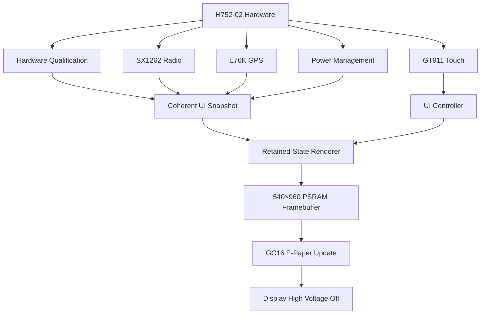

<div align="center">

# supportFORGE Field Terminal

### Touch-first monitoring, communications, and navigation on e-paper

[](https://platformio.org/)
[](https://www.espressif.com/en/products/socs/esp32-s3)
[](https://isocpp.org/)
[](#display-and-refresh-policy)
[](#radio-safety)
[](#target-hardware)
[](#current-status)

A portable **supportFORGE field terminal** for the LILYGO T5 E-Paper S3 Pro, combining a large touch-enabled e-paper display, ESP32-S3, LoRa, GPS, local storage, and low-power operation.

</div>

> [!IMPORTANT]
> This repository contains the verified hardware-qualification foundation and a live Guardian telemetry client. Additional incident, navigation, and communications features remain future work.

---

## Target hardware

| Component | Hardware |
|---|---|
| Product | LILYGO T5 E-Paper S3 Pro |
| Product/SKU | H752-02 |
| MCU | ESP32-S3 |
| Flash | 16 MB |
| PSRAM | 8 MB |
| Display | 4.7-inch ED047TC1 e-paper |
| Resolution | 960 × 540 physical |
| UI orientation | 540 × 960 portrait |
| Touch | GT911 capacitive touchscreen |
| Radio | SX1262 LoRa |
| Region | 915 MHz |
| Navigation | L76K GPS/GNSS |
| Storage | TF/microSD |
| RTC | PCF8563-compatible device |
| Battery monitoring | BQ27220 fuel gauge |
| Development | PlatformIO + Arduino framework + C++17 |

`H752-02` is treated as LILYGO’s product/SKU designation for the H752-based configuration containing an **SX1262 915 MHz radio** and **L76K GPS**. It is not expected to exist as a Git branch name.

---

## Current status

| Subsystem | Status | Notes |
|---|---:|---|
| ESP32-S3 boot | ✅ Verified | Stable physical boot |
| PSRAM | ✅ Verified | Available to the full display framebuffer |
| Portrait orientation | ✅ Physically observed | Screen is upright and functional |
| Full display cleanup | ✅ Physically accepted | Guarded recovery clear reduced prior retained material to an acceptable background |
| Full-quality rendering | ✅ Physically accepted | Reinforced Inter typography, normalized icons, and GC16 HOME accepted on H752-02 |
| Display power shutdown | ✅ Verified | High voltage disabled after rendering |
| Touch controller | ✅ Physically qualified | Four-corner mapping is persisted in NVS |
| RTC | ✅ Observed | PCF8563-compatible device |
| Battery fuel gauge | ✅ Observed | BQ27220 |
| GPS communication | ✅ Verified | L76K NMEA and valid fix observed |
| SX1262 initialization | ✅ Verified | 915 MHz, receive-only |
| LoRa transmission | 🔒 Locked | Intentionally unavailable |
| microSD | ⏳ Unverified | No card present during qualification |
| Partial refresh | 🔒 Disabled | Requires separate physical qualification |
| supportFORGE Guardian API | ✅ Implemented | Header-authenticated dual-endpoint telemetry; physical network validation remains |
| Mesh/LoRaWAN | 🚧 Planned | Protocol architecture not yet selected |

> [!NOTE]
> A successful build is not considered physical hardware confirmation. Results are promoted to verified only after observation on the actual H752-02 device.

> [!WARNING]
> The prior physical-device photograph remains evidence of the original failure: it was
> upright and functional but failed UI acceptance due to stale-image contamination,
> header overlap, unsuitable typography, weak grayscale separation, clipped text,
> detached values, and unusable bottom navigation. The corrected HOME has now been
> physically accepted for typography, icon balance, clipping, and background cleanup.

---

## UI shell

The current firmware provides a retained-state, touch-first interface designed specifically for grayscale e-paper.

### Available pages

- **Home** — monitored host, overall/freshness state, CPU, RAM, primary storage, host temperature, device battery, Wi-Fi, endpoint, incidents, and schedule
- **Systems** — touch-paginated Overview, two bounded Storage pages (up to six disks), and Network telemetry sections
- **Radio** — SX1262 status and LoRa safety state
- **Location** — GPS status and future navigation tools
- **Device** — Field Terminal battery, Wi-Fi, endpoint, last synchronization, poll interval, temperature unit, manual refresh, and diagnostics
- **Hardware Diagnostics** — structured qualification evidence

The interface uses:

- A complete 540 × 960 framebuffer in PSRAM
- Centralized spacing, typography, and grayscale tokens
- Reusable cards, status pills, metric tiles, rows, and navigation
- Explicit dirty-state rendering
- Coherent UI snapshots
- Large touch targets
- Truthful setup and unavailable states
- No fabricated hosts, incidents, telemetry, or connection results

### UI design previews

> [!CAUTION]
> These PNGs are **design previews**, not proof of physical fidelity and not
> framebuffer-identical firmware output. They use the approved font source and
> authoritative geometry, but Pillow still redraws the UI independently. For
> pixel-authoritative review, convert an actual firmware framebuffer dump with
> `tools/framebuffer_to_png.py` and complete the physical acceptance checklist.

<table>
  <tr>
    <td align="center"><strong>Home</strong></td>
    <td align="center"><strong>Systems</strong></td>
    <td align="center"><strong>Radio</strong></td>
  </tr>
  <tr>
    <td></td>
    <td></td>
    <td></td>
  </tr>
  <tr>
    <td align="center"><strong>Location</strong></td>
    <td align="center"><strong>Device</strong></td>
    <td align="center"><strong>Diagnostics</strong></td>
  </tr>
  <tr>
    <td></td>
    <td></td>
    <td></td>
  </tr>
</table>

---

## Architecture



Hardware and network callbacks do not render directly. Guardian polling runs in a FreeRTOS task and publishes a short-mutex-protected copyable snapshot. The UI copies one coherent version, applies material-change thresholds, composes a complete page in memory, and pushes it during one controlled display operation.

---

## Guardian telemetry

The Field Terminal polls a direct Guardian JSON object every **60 seconds**. Supported fields are:

- `cpu_load`, `cpu_temp`
- `ram_used_gb`, `ram_total_gb` and computed RAM percentage
- bounded `disks[]`: `fs`, `mount`, `sizeBytes`, `usedBytes`, `availableBytes`, `usedPercent`
- `nvme_temp`, `system_status`, `uptime_seconds`
- `speedtest.down`, `up`, `ping`, `last_run`, `is_running`, `status`, `started_at`, `error`, and `provider`

Every field has its own availability state. Missing optional values render as `--`; they are never fabricated as zero. Malformed JSON and objects with no recognized telemetry are rejected. Host identity is resolved independently in this order: `hostname`, `host`, `device_name`, `deviceName`, `name`, `machine`, then `SUPPORTFORGE_TARGET_HOST_NAME`.

### Endpoint and alarm behavior

- Boot preference is **EP1**, followed by **EP2** only for DNS, connect, timeout, or negative transport failures.
- Normal HTTP responses—including 401, 403, and 404—do not trigger silent failover.
- After EP2 succeeds it remains preferred; EP1 is probed every 60 seconds and resumes preference after a valid response.
- A complete EP1/EP2 attempt sequence counts as one polling-cycle failure.
- Previous telemetry remains visible during `CHECK 1 OF 3` and `CHECK 2 OF 3`; `OFFLINE` begins only after three failed cycles.
- Any valid payload immediately resets failures, clears the transport offline alarm, records success and endpoint, and publishes a new snapshot.
- `STALE` means the last valid snapshot is older than the configured freshness threshold. `DEGRADED` means EP2 is active or optional fields are absent. An explicit Guardian `system_status: "OFFLINE"` is respected independently of transport reachability.

Safe customer-facing endpoint labels are only `EP1` and `EP2`; IP addresses are not rendered.

### Polling versus rendering

Polling and display updates are deliberately separate. Every meaningful result creates a snapshot version, but GC16 is requested only for page/user actions, status/endpoint/failure/freshness changes, or material telemetry changes: CPU 2 points, RAM 1 point, displayed temperature 1 degree, and disk use 1 point. Multiple changes coalesce into one complete white-frame render. Partial refresh remains off and high voltage is shut down after every update.

### Temperature units

The verified Guardian contract uses **Fahrenheit as the source unit**. The Field Terminal stores that canonical value and converts only for presentation. Celsius is the default display unit; Device → `C / F UNIT` toggles Celsius/Fahrenheit and writes Preferences/NVS only when the selection changes.

### Local time and device settings

The status area uses system time synchronized by NTP after the Guardian-owned
Wi-Fi connection is available. A PCF8563-compatible RTC provides holdover when
its voltage-low flag is clear, and a successful NTP synchronization updates the
RTC in UTC. Device → **Device Settings** provides timezone, 12/24-hour format,
sync state, manual NTP sync, and the last successful sync. Timezone and clock
format are persisted in NVS.

The documented first-boot default is **UTC with a 24-hour clock**. Timezone
choices use POSIX timezone/DST rules in the time service rather than dates or DST
logic embedded in UI rendering. Until RTC or NTP time is trustworthy, the header
shows `--:--` and `TIME SYNC`. Display dirtiness compares the visible minute and
date, never seconds.

### Field Terminal battery

The BQ27220 has been observed at its expected I²C address, but this repository
does not contain a physically qualified gauge data-memory profile and register
contract for this battery pack. Firmware therefore performs no guessed SOC,
flags, scaling, or charger-state reads and reports **BAT UNKNOWN** / `--` rather
than fabricating a percentage. A percentage or `CHARGING` state must not be
enabled until that contract is documented and physically qualified.

### Weather card

HOME includes a distinct Field Conditions card backed by Open-Meteo. Weather is
optional and configured only through the ignored `src/secrets.h`; documented
placeholders for latitude, longitude, city label, and C/F unit are provided in
`src/secrets.example.h`. The weather task observes the existing Wi-Fi connection
but never starts, stops, or reconfigures Wi-Fi and never publishes into Guardian
state. It polls no more often than every 15 minutes, retains the last good sample
for up to 45 minutes, and reports `WX SETUP` or `WX OFFLINE` truthfully.

Weather diagnostics log only configured yes/no, result classification, and data
validity. Coordinates, complete request URLs, and response bodies are never
logged. Weather failures cannot increment Guardian failures, change the Guardian
online/offline state, or affect its three-cycle alarm threshold.

---

## Build

### Requirements

- Visual Studio Code
- PlatformIO
- Python 3 for UI preview generation and contract tests
- USB-C data cable

### Compile

```powershell
pio run -e h752_02_candidate
```

### Upload

Identify the correct serial port before uploading:

```powershell
pio device list
```

Then replace `COMx` with the verified device port:

```powershell
pio run -e h752_02_candidate -t upload --upload-port COMx
```

### Serial monitor

```powershell
pio device monitor --port COMx --baud 115200
```

---

## Tests and previews

Generate all 540 × 960 structural design previews. They use the same approved
Inter TTF role assets, geometry, and palette as firmware, but are
not framebuffer-identical and cannot model the ED047TC1 waveform or panel optics:

```powershell
python tools/render_ui_previews.py
```

Convert a real 259,200-byte packed 4-bit framebuffer dump instead of redrawing:

```powershell
python tools/framebuffer_to_png.py frame.bin frame.png
```

Capture that authoritative buffer over USB without refreshing the panel:

```powershell
python tools/capture_framebuffer.py COM15 home artifacts/home.bin
```

Run the UI contract tests:

```powershell
python -m unittest discover -s test -p "test_*.py" -v
```

The tests cover:

- Portrait geometry
- Complete all-white composition before every page
- Framebuffer guard/canary policy and 4-bit nibble polarity
- Touch-coordinate transformation
- Coordinate clamping
- Navigation behavior
- Touch-target bounds
- Proportional font asset/license contract and clipped text bounds
- Five equal 108 × 96 navigation targets
- Guided four-corner setup and persistence
- GPS diagnostic privacy
- LoRa transmission-lock visibility
- Display power-off ordering
- Partial-refresh feature gating

---

## Display and refresh policy

E-paper is not treated like an ordinary LCD.

At boot, the firmware:

1. Resets the complete 960 × 540 packed physical composition buffer to `0xFF`
   (both 4-bit nibbles white), then builds the complete 540 × 960 logical page.
2. Verifies 64-byte canaries before and after the composition buffer.
3. Copies the complete 259,200-byte frame to EPDiy.
4. Immediately before the first corrected HOME frame, performs the guarded
   LILYGO-derived physical recovery clear once per boot; this is never part of
   normal navigation. On an unqualified unit this waits until touch setup completes.
5. Performs one full-quality `MODE_GC16` update.
6. Powers down the e-paper high-voltage circuitry.

Normal page changes:

- Compose the complete destination page before display power-on
- Use full-quality GC16 updates
- Do not invoke `epd_fullclear()`
- Power down the display after every attempted update
- Do not redraw continuously

The serial command `display white-test` reaches the same guarded once-per-boot recovery
path. Repeated cleanup cycles are prevented. The current candidate board profile
overlaps Arduino SPI/radio GPIOs with EPD v7 parallel data pins, so display
refresh first stops receive mode and calls `SPI.end()` to release GPIO ownership.

> [!WARNING]
> Partial refresh is compile-time gated **OFF** until it receives dedicated physical ghosting, orientation, waveform, and recovery qualification.

---

## Touch qualification

The target H752-02 has completed physical four-corner qualification. Its mapping
is persisted in ESP32 Preferences/NVS and normal firmware uploads preserve it;
do not reset or repeat qualification during typography work.

On first run, touch navigation remains locked and the device displays a guided
TOUCH SETUP page until the physical display corners are verified under
`EPD_ROT_INVERTED_PORTRAIT`. Tap the four displayed targets in order. Center
taps, swipes, and taps outside the requested corner are rejected. The visible
target and `N OF 4` progress advance after every accepted corner using GC16. After
the fourth corner, qualification is saved to NVS once, HOME is rendered with a
visible `TOUCH READY` status, and navigation unlocks. Requalification is an
explicit serial diagnostic action (`touch reset`), not a normal Device-page tap.

The serial fallback remains available:

```text
touch reset
```

Touch the visible display in this order:

1. Top-left
2. Top-right
3. Bottom-left
4. Bottom-right

The portrait transform is:

```text
logicalX = 539 - rawY
logicalY = rawX
```

Coordinates are clamped to the logical 540 × 960 canvas. Tap handling includes movement rejection, debounce, press/release state, and one accepted action per release.

---

## Diagnostic commands

| Command | Purpose |
|---|---|
| `profile` | Show the active H752-02 candidate profile |
| `identify` | Report safe device and build information |
| `i2c` | Scan the verified I²C bus |
| `touch reset` | Reset and rerun physical four-corner touch qualification |
| `sd test` | Attempt a non-destructive microSD qualification |
| `rail on` | Enable the candidate shared LoRa/GPS rail |
| `rail off` | Disable the shared peripheral rail |
| `lora probe` | Initialize and sleep the SX1262 without transmitting |
| `lora rx` | Enter receive-only LoRa operation |
| `gps listen` | Observe GPS UART RX without driving GPS TX |
| `page home` | Render the HOME page |
| `page systems` | Render the SYSTEMS page |
| `page radio` | Render the RADIO page |
| `page location` | Render the LOCATION page |
| `page device` | Render the DEVICE page |
| `page diagnostics` | Render hardware diagnostics |
| `display white-test` | Perform the guarded once-per-boot white-panel diagnostic |

Use page-rendering commands sparingly while GC16 remains the only qualified update mode.

---

## Radio safety

> [!CAUTION]
> Attach the correct **915 MHz antenna** before enabling or testing the SX1262 radio.

Current radio behavior:

- Uses the 915 MHz hardware profile
- Initializes in receive-only mode
- Does not transmit during boot
- Does not beacon automatically
- Does not perform a LoRaWAN join
- Does not expose a transmit API to the application
- Sleeps the radio after qualification
- Displays `LORA TX LOCKED` in the interface

LoRa, LoRaWAN, Meshtastic, MeshCore, and custom point-to-point protocols are separate operating choices and are not automatically interoperable.

---

## GPS privacy

GPS serial diagnostics report only:

- Bytes received
- Lines observed
- Module response state
- Fix classification

Raw NMEA sentences and precise coordinates are redacted from default diagnostic output.

Coordinates may eventually appear locally on the physical terminal when navigation is enabled, but they must not be included in ordinary logs, previews, test fixtures, or completion reports.

---

## Required physical qualification sequence

1. Record the product label, PCB markings, antenna band, and GPS model.
2. Run `profile`, followed by `i2c`.
3. Compare observed I²C devices against the hardware qualification record.
4. Attach the correct 915 MHz antenna.
5. Run `rail on`, followed by `lora probe`.
6. Use `lora rx` only for receive-only testing.
7. Run `gps listen` outdoors when validating acquisition and navigation.
8. Inspect the HOME screen for orientation, cleanup, readability, and grayscale quality.
9. Run `touch reset` only if deliberate touch requalification is required.
10. Evaluate the remaining pages sparingly.
11. Use `display white-test` only for deliberate once-per-boot panel diagnostics.
12. Run `rail off` when radio and GPS testing is complete.

Record evidence in:

[`docs/HARDWARE_QUALIFICATION.md`](docs/HARDWARE_QUALIFICATION.md)

---

## Project structure

```text
supportforge-field-terminal/
├── docs/
│   ├── HARDWARE_QUALIFICATION.md
│   └── ui-previews/
├── include/
├── lib/
│   └── epdiy/
├── src/
│   ├── input/
│   ├── ui/
│   └── main.cpp
├── test/
├── tools/
├── platformio.ini
└── README.md
```

The local EPDiy snapshot is derived from LILYGO’s modified upstream source. Its exact revision, retained files, modifications, and license provenance are documented in:

[`lib/epdiy/UPSTREAM.md`](lib/epdiy/UPSTREAM.md)

---

## Roadmap

### Hardware foundation

- [x] ESP32-S3 and PSRAM qualification
- [x] Correct portrait orientation
- [x] Full-panel cleanup
- [x] GC16 rendering
- [x] Display power shutdown
- [x] GT911 detection
- [x] RTC detection
- [x] Battery fuel-gauge detection
- [x] L76K communication and GPS fix
- [x] SX1262 receive-only initialization
- [x] Physical touch-corner qualification
- [ ] microSD card qualification
- [ ] Partial-refresh qualification
- [ ] Deep-sleep current measurement

### Field Terminal

- [x] Retained-state UI architecture
- [x] Touch-first navigation foundation
- [x] Firmware-contract screen previews
- [x] Hardware diagnostics interface
- [ ] supportFORGE provisioning
- [x] Live Guardian host telemetry
- [ ] Incident and alarm management
- [x] Persistent temperature-unit setting
- [ ] Historical telemetry
- [ ] GPS navigation and waypoints
- [ ] LoRa point-to-point messaging
- [ ] Encrypted device identity
- [ ] Mesh protocol evaluation
- [ ] LoRaWAN evaluation
- [ ] OTA firmware updates
- [ ] Low-power operating profiles

---

## Secrets and local configuration

Real credentials must never be committed.

The local secrets file is ignored:

```text
src/secrets.h
```

Copy the tracked generic example and edit only the ignored local file:

```powershell
Copy-Item src/secrets.example.h src/secrets.h
```

Required macros are:

- `SUPPORTFORGE_WIFI_SSID`
- `SUPPORTFORGE_WIFI_PASSWORD`
- `SUPPORTFORGE_PRIMARY_TELEMETRY_URL`
- `SUPPORTFORGE_FALLBACK_TELEMETRY_URL`
- `SUPPORTFORGE_GUARDIAN_TOKEN`
- `SUPPORTFORGE_TARGET_HOST_NAME`

`app_config.h` binds these macros to typed constants and contains only non-secret defaults, intervals, thresholds, and timeouts. If placeholders remain, the UI truthfully reports `SETUP REQUIRED` / `NOT CONFIGURED` and performs no network request.

Authentication uses the `x-guardian-telemetry-token` request header. Query-token compatibility is explicitly disabled, so tokens do not enter URLs, browser history, or endpoint diagnostics. Serial telemetry output is restricted to EP1/EP2, redacted path, transport category, HTTP status, parser result/recognized count, active endpoint, and snapshot version. It never prints SSID, password, MAC, configured URL, response body, or token data.

> [!WARNING]
> Never paste or commit credentials, tokenized URLs, or telemetry response bodies. Prefer a Field Terminal-specific Guardian token when the backend supports multiple device tokens. If only one global Guardian token is currently accepted, use it locally only as a temporary compatibility measure and implement multi-device tokens as a separate supportFORGE backend task.

Never commit:

- Wi-Fi credentials
- supportFORGE authentication tokens
- Private API endpoints
- LoRa encryption keys
- Exact private GPS history
- Serial logs containing private device information

---

## Licensing

The vendored LILYGO-derived EPDiy files retain their original license and attribution. See:

[`lib/epdiy/UPSTREAM.md`](lib/epdiy/UPSTREAM.md)

A project-level license should be selected before declaring the complete repository open source. Third-party components remain governed by their respective licenses.

UI fonts use **Inter 4.1** and **Atkinson Hyperlegible** under the SIL Open Font
License 1.1. License texts are retained in `assets/fonts/Inter-OFL.txt` and
`assets/fonts/OFL.txt`. Primary UI assets use genuine Inter SemiBold and Bold
source files with physically selected reinforced antialiasing; Atkinson Regular is retained only as a Diagnostics
comparison sample.

---

## Project philosophy

The Field Terminal follows four rules:

1. **Physical evidence beats assumptions.**
2. **Unavailable data is never fabricated.**
3. **E-paper updates are deliberate and power-aware.**
4. **Radio transmission remains locked until explicitly qualified.**

---

<div align="center">

Built as a portable companion to **supportFORGE**

**ESP32-S3 · E-Paper · Touch · LoRa · GPS · PlatformIO**

</div>