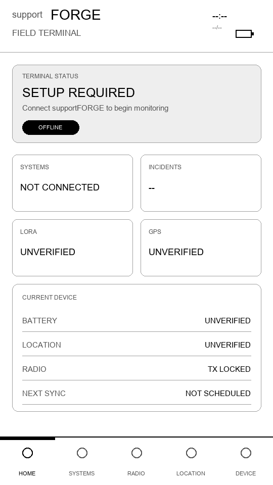
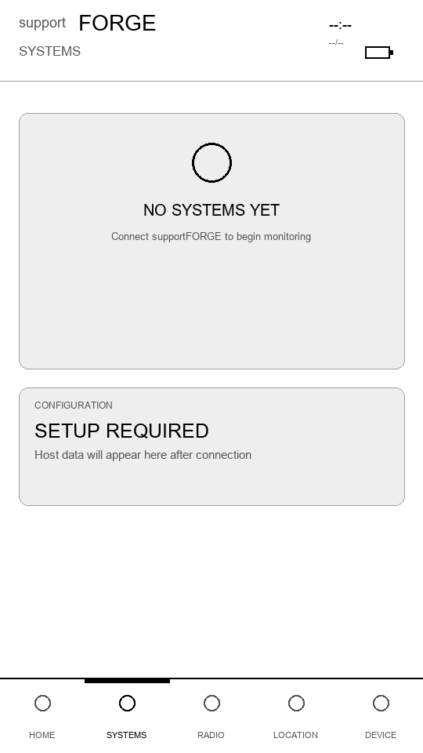
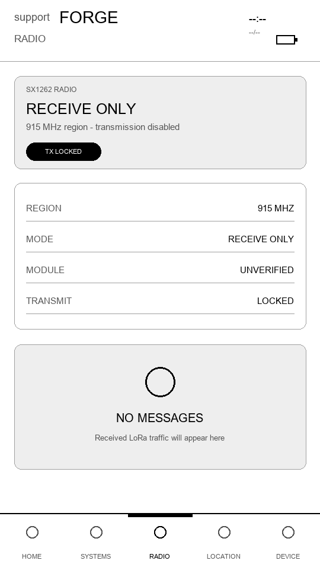
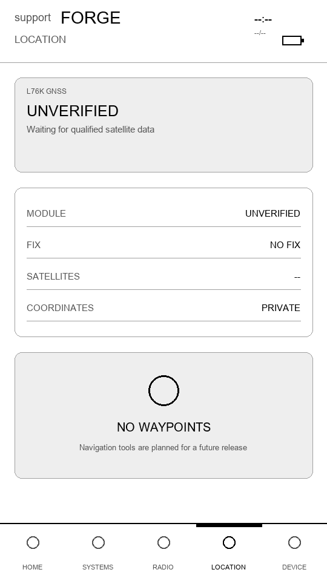
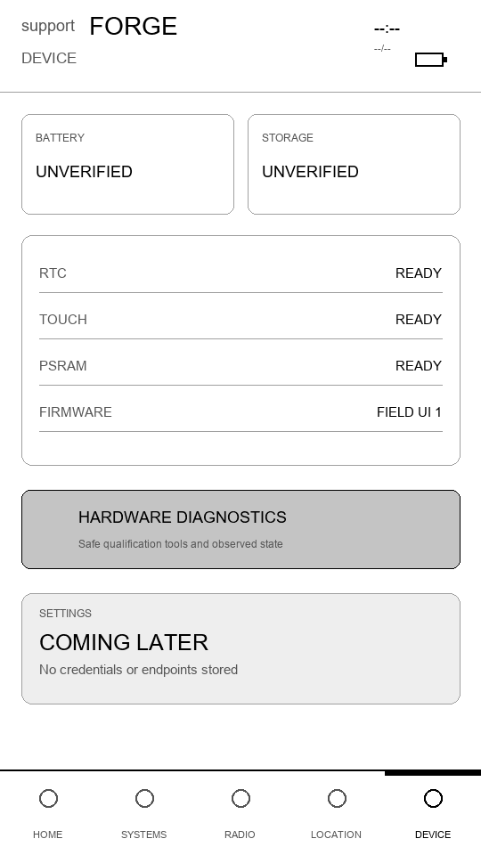
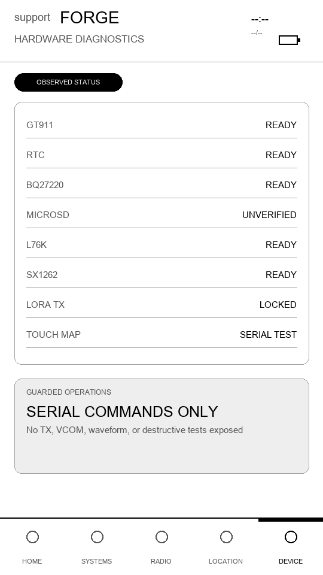
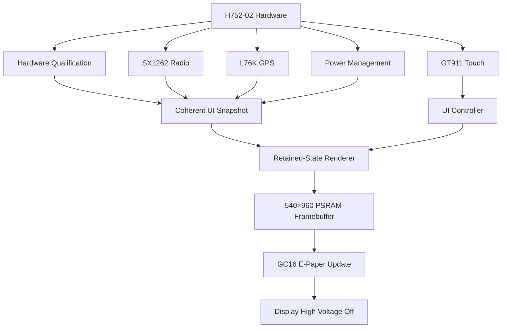

<div align="center">

# supportFORGE Field Terminal

### Touch-first monitoring, communications, and navigation on e-paper

[](https://platformio.org/)
[](https://www.espressif.com/en/products/socs/esp32-s3)
[](https://isocpp.org/)
[](#display-and-refresh-policy)
[](#radio-safety)
[](#target-hardware)
[](#current-status)

A portable **supportFORGE field terminal** for the LILYGO T5 E-Paper S3 Pro, combining a large touch-enabled e-paper display, ESP32-S3, LoRa, GPS, local storage, and low-power operation.

</div>

> [!IMPORTANT]
> This repository currently contains the verified hardware-qualification firmware and first retained-state UI shell. It is **not yet the complete supportFORGE Field Terminal application**.

---

## Target hardware

| Component | Hardware |
|---|---|
| Product | LILYGO T5 E-Paper S3 Pro |
| Product/SKU | H752-02 |
| MCU | ESP32-S3 |
| Flash | 16 MB |
| PSRAM | 8 MB |
| Display | 4.7-inch ED047TC1 e-paper |
| Resolution | 960 × 540 physical |
| UI orientation | 540 × 960 portrait |
| Touch | GT911 capacitive touchscreen |
| Radio | SX1262 LoRa |
| Region | 915 MHz |
| Navigation | L76K GPS/GNSS |
| Storage | TF/microSD |
| RTC | PCF8563-compatible device |
| Battery monitoring | BQ27220 fuel gauge |
| Development | PlatformIO + Arduino framework + C++17 |

`H752-02` is treated as LILYGO’s product/SKU designation for the H752-based configuration containing an **SX1262 915 MHz radio** and **L76K GPS**. It is not expected to exist as a Git branch name.

---

## Current status

| Subsystem | Status | Notes |
|---|---:|---|
| ESP32-S3 boot | ✅ Verified | Stable physical boot |
| PSRAM | ✅ Verified | Available to the full display framebuffer |
| Portrait orientation | ✅ Verified | `EPD_ROT_INVERTED_PORTRAIT` |
| Full display cleanup | ✅ Verified | LILYGO-derived full-clear sequence |
| Full-quality rendering | ✅ Verified | `MODE_GC16` |
| Display power shutdown | ✅ Verified | High voltage disabled after rendering |
| Touch controller | ✅ Detected | Physical four-corner qualification required |
| RTC | ✅ Observed | PCF8563-compatible device |
| Battery fuel gauge | ✅ Observed | BQ27220 |
| GPS communication | ✅ Verified | L76K NMEA and valid fix observed |
| SX1262 initialization | ✅ Verified | 915 MHz, receive-only |
| LoRa transmission | 🔒 Locked | Intentionally unavailable |
| microSD | ⏳ Unverified | No card present during qualification |
| Partial refresh | 🔒 Disabled | Requires separate physical qualification |
| supportFORGE API | 🚧 Planned | No credentials or endpoint required yet |
| Mesh/LoRaWAN | 🚧 Planned | Protocol architecture not yet selected |

> [!NOTE]
> A successful build is not considered physical hardware confirmation. Results are promoted to verified only after observation on the actual H752-02 device.

---

## UI shell

The current firmware provides a retained-state, touch-first interface designed specifically for grayscale e-paper.

### Available pages

- **Home** — overall terminal state and setup guidance
- **Systems** — future supportFORGE hosts and services
- **Radio** — SX1262 status and LoRa safety state
- **Location** — GPS status and future navigation tools
- **Device** — battery, storage, RTC, and firmware information
- **Hardware Diagnostics** — structured qualification evidence

The interface uses:

- A complete 540 × 960 framebuffer in PSRAM
- Centralized spacing, typography, and grayscale tokens
- Reusable cards, status pills, metric tiles, rows, and navigation
- Explicit dirty-state rendering
- Coherent UI snapshots
- Large touch targets
- Truthful setup and unavailable states
- No fabricated hosts, incidents, telemetry, or connection results

### UI previews

<table>
  <tr>
    <td align="center"><strong>Home</strong></td>
    <td align="center"><strong>Systems</strong></td>
    <td align="center"><strong>Radio</strong></td>
  </tr>
  <tr>
    <td></td>
    <td></td>
    <td></td>
  </tr>
  <tr>
    <td align="center"><strong>Location</strong></td>
    <td align="center"><strong>Device</strong></td>
    <td align="center"><strong>Diagnostics</strong></td>
  </tr>
  <tr>
    <td></td>
    <td></td>
    <td></td>
  </tr>
</table>

---

## Architecture



Hardware callbacks do not render directly. State is collected into a coherent snapshot, the complete page is composed in memory, and the finished framebuffer is pushed during one controlled display operation.

---

## Build

### Requirements

- Visual Studio Code
- PlatformIO
- Python 3 for UI preview generation and contract tests
- USB-C data cable

### Compile

```powershell
pio run -e h752_02_candidate
```

### Upload

Identify the correct serial port before uploading:

```powershell
pio device list
```

Then replace `COMx` with the verified device port:

```powershell
pio run -e h752_02_candidate -t upload --upload-port COMx
```

### Serial monitor

```powershell
pio device monitor --port COMx --baud 115200
```

---

## Tests and previews

Generate all deterministic 540 × 960 UI previews:

```powershell
python tools/render_ui_previews.py
```

Run the UI contract tests:

```powershell
python -m unittest discover -s test -p "test_*.py" -v
```

The tests cover:

- Portrait geometry
- Touch-coordinate transformation
- Coordinate clamping
- Navigation behavior
- Touch-target bounds
- Dirty-state behavior
- GPS diagnostic privacy
- LoRa transmission-lock visibility
- Display power-off ordering
- Partial-refresh feature gating

---

## Display and refresh policy

E-paper is not treated like an ordinary LCD.

At boot, the firmware:

1. Builds the complete HOME page in the PSRAM framebuffer.
2. Powers on the display circuitry.
3. Performs one full-quality `MODE_GC16` update.
4. Powers down the e-paper high-voltage circuitry.

Normal page changes:

- Compose the complete destination page before display power-on
- Use full-quality GC16 updates
- Do not invoke `epd_fullclear()`
- Power down the display after every attempted update
- Do not redraw continuously

The serial command `display clear` exposes the verified LILYGO-derived cleanup operation as a guarded, once-per-boot recovery action.

> [!WARNING]
> Partial refresh is compile-time gated **OFF** until it receives dedicated physical ghosting, orientation, waveform, and recovery qualification.

---

## Touch qualification

Touch navigation remains locked until the physical display corners are verified under `EPD_ROT_INVERTED_PORTRAIT`.

From the serial console, run:

```text
touch corners
```

Touch the visible display in this order:

1. Top-left
2. Top-right
3. Bottom-left
4. Bottom-right

The portrait transform is:

```text
logicalX = 539 - rawY
logicalY = rawX
```

Coordinates are clamped to the logical 540 × 960 canvas. Tap handling includes movement rejection, debounce, press/release state, and one accepted action per release.

---

## Diagnostic commands

| Command | Purpose |
|---|---|
| `profile` | Show the active H752-02 candidate profile |
| `identify` | Report safe device and build information |
| `i2c` | Scan the verified I²C bus |
| `touch corners` | Perform physical four-corner touch qualification |
| `sd test` | Attempt a non-destructive microSD qualification |
| `rail on` | Enable the candidate shared LoRa/GPS rail |
| `rail off` | Disable the shared peripheral rail |
| `lora probe` | Initialize and sleep the SX1262 without transmitting |
| `lora rx` | Enter receive-only LoRa operation |
| `gps listen` | Observe GPS UART RX without driving GPS TX |
| `page home` | Render the HOME page |
| `page systems` | Render the SYSTEMS page |
| `page radio` | Render the RADIO page |
| `page location` | Render the LOCATION page |
| `page device` | Render the DEVICE page |
| `page diagnostics` | Render hardware diagnostics |
| `display clear` | Perform the guarded full-panel recovery cleanup |

Use page-rendering commands sparingly while GC16 remains the only qualified update mode.

---

## Radio safety

> [!CAUTION]
> Attach the correct **915 MHz antenna** before enabling or testing the SX1262 radio.

Current radio behavior:

- Uses the 915 MHz hardware profile
- Initializes in receive-only mode
- Does not transmit during boot
- Does not beacon automatically
- Does not perform a LoRaWAN join
- Does not expose a transmit API to the application
- Sleeps the radio after qualification
- Displays `LORA TX LOCKED` in the interface

LoRa, LoRaWAN, Meshtastic, MeshCore, and custom point-to-point protocols are separate operating choices and are not automatically interoperable.

---

## GPS privacy

GPS serial diagnostics report only:

- Bytes received
- Lines observed
- Module response state
- Fix classification

Raw NMEA sentences and precise coordinates are redacted from default diagnostic output.

Coordinates may eventually appear locally on the physical terminal when navigation is enabled, but they must not be included in ordinary logs, previews, test fixtures, or completion reports.

---

## Required physical qualification sequence

1. Record the product label, PCB markings, antenna band, and GPS model.
2. Run `profile`, followed by `i2c`.
3. Compare observed I²C devices against the hardware qualification record.
4. Attach the correct 915 MHz antenna.
5. Run `rail on`, followed by `lora probe`.
6. Use `lora rx` only for receive-only testing.
7. Run `gps listen` outdoors when validating acquisition and navigation.
8. Inspect the HOME screen for orientation, cleanup, readability, and grayscale quality.
9. Run `touch corners`.
10. Evaluate the remaining pages sparingly.
11. Use `display clear` only for genuine ghosting or recovery.
12. Run `rail off` when radio and GPS testing is complete.

Record evidence in:

[`docs/HARDWARE_QUALIFICATION.md`](docs/HARDWARE_QUALIFICATION.md)

---

## Project structure

```text
supportforge-field-terminal/
├── docs/
│   ├── HARDWARE_QUALIFICATION.md
│   └── ui-previews/
├── include/
├── lib/
│   └── epdiy/
├── src/
│   ├── input/
│   ├── ui/
│   └── main.cpp
├── test/
├── tools/
├── platformio.ini
└── README.md
```

The local EPDiy snapshot is derived from LILYGO’s modified upstream source. Its exact revision, retained files, modifications, and license provenance are documented in:

[`lib/epdiy/UPSTREAM.md`](lib/epdiy/UPSTREAM.md)

---

## Roadmap

### Hardware foundation

- [x] ESP32-S3 and PSRAM qualification
- [x] Correct portrait orientation
- [x] Full-panel cleanup
- [x] GC16 rendering
- [x] Display power shutdown
- [x] GT911 detection
- [x] RTC detection
- [x] Battery fuel-gauge detection
- [x] L76K communication and GPS fix
- [x] SX1262 receive-only initialization
- [ ] Physical touch-corner qualification
- [ ] microSD card qualification
- [ ] Partial-refresh qualification
- [ ] Deep-sleep current measurement

### Field Terminal

- [x] Retained-state UI architecture
- [x] Touch-first navigation foundation
- [x] Deterministic screen previews
- [x] Hardware diagnostics interface
- [ ] supportFORGE provisioning
- [ ] Live host and service telemetry
- [ ] Incident and alarm management
- [ ] Persistent settings
- [ ] Historical telemetry
- [ ] GPS navigation and waypoints
- [ ] LoRa point-to-point messaging
- [ ] Encrypted device identity
- [ ] Mesh protocol evaluation
- [ ] LoRaWAN evaluation
- [ ] OTA firmware updates
- [ ] Low-power operating profiles

---

## Secrets and local configuration

Real credentials must never be committed.

The local secrets file is ignored:

```text
src/secrets.h
```

If configuration becomes necessary, begin with the tracked example file and keep the real device-specific version local.

Never commit:

- Wi-Fi credentials
- supportFORGE authentication tokens
- Private API endpoints
- LoRa encryption keys
- Exact private GPS history
- Serial logs containing private device information

---

## Licensing

The vendored LILYGO-derived EPDiy files retain their original license and attribution. See:

[`lib/epdiy/UPSTREAM.md`](lib/epdiy/UPSTREAM.md)

A project-level license should be selected before declaring the complete repository open source. Third-party components remain governed by their respective licenses.

---

## Project philosophy

The Field Terminal follows four rules:

1. **Physical evidence beats assumptions.**
2. **Unavailable data is never fabricated.**
3. **E-paper updates are deliberate and power-aware.**
4. **Radio transmission remains locked until explicitly qualified.**

---

<div align="center">

Built as a portable companion to **supportFORGE**

**ESP32-S3 · E-Paper · Touch · LoRa · GPS · PlatformIO**

</div>